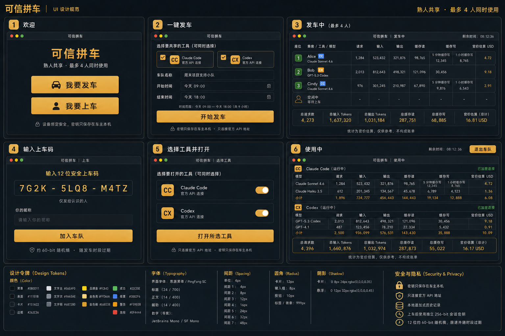

# 可信拼车（Trusted Carpool）

**中文** | [English](README.en.md)

[](https://github.com/sunjackson/ai-trusted-carpool/actions/workflows/build-desktop.yml)
[](https://github.com/sunjackson/ai-trusted-carpool/actions/workflows/codeql.yml)
[](LICENSE)
[](https://github.com/sunjackson/ai-trusted-carpool/releases)

> [!WARNING]
> **使用须知**：多人共用同一个 Claude/Codex 官方订阅账号，与 Anthropic《Consumer Terms》和 OpenAI《Terms of Use》中"禁止共享账号凭据/让他人使用你的账号"的条款存在直接冲突，可能导致账号被限流或封禁且不予退款。请仅与彼此信任的熟人使用，风险由账号所有者自行承担。详见 [LEGAL.md](LEGAL.md)。

面向熟人之间的 Claude Code 与 Codex 本机账号共享桌面端。车主选择一个明确的开放时间段，一键发车并获得四个座位码；乘客输入座位码后即可打开任一工具，两个工具可同时运行。**代码与自建能力永久免费开源**，详见 [商业模式说明](docs/BUSINESS-MODEL.md)。



## 目录

- [核心能力](#核心能力)
- [安装](#安装)
- [本地开发](#本地开发)
- [打包](#打包)
- [安全边界](#安全边界)
- [自建部署](#自建部署)
- [如何维持运营](#如何维持运营)
- [参与贡献](#参与贡献)
- [许可证](#许可证)

## 核心能力

- Claude Code 与 Codex 平等支持，可单独或同时发车。
- 自动检测本机 Claude Code / Codex 命令行与官方桌面客户端；未安装命令行时可在应用内一键安装（调用官方 npm 包 `@anthropic-ai/claude-code`、`@openai/codex`，思路参考 CC Switch）。
- 车主复制 `https://p2p.cnaigc.ai/api/v1/carpool/join/<上车码>` 官方链接；好友点击后自动唤起客户端并带入座位，已保存昵称时直接发起上车。
- 上车后可一键打开 Claude/Codex 终端或官方桌面客户端；已安装客户端时默认优先客户端。
- 每辆车最多四名乘客并发，每个座位独立绑定设备。
- 优先 WebRTC 直连，失败时自动使用 TURN；应用层请求仍端到端加密。
- 密钥只保存在车主本机，只允许 Anthropic、OpenAI/ChatGPT 官方接口。
- 按成员 → 工具 → 模型实时统计请求、输入、输出、缓存读写及官方 USD 标准价估算。
- 成员列表只显示总量、请求数、官价和关键限额；点击成员再查看按模型明细。
- 车主可分别设置每名成员的 5 小时、24 小时和 7 天滚动 Token 限额。
- 车主与在线成员同步查看车主官方 Claude/Codex 账号的剩余额度；API Key 无订阅额度接口时明确显示不可用。
- 本地追加式历史只记录用量元数据，不保存提示词、响应正文、密钥、会话密钥或上车码。
- macOS 菜单栏、Windows 托盘和 Linux 状态区持续显示空闲、发车人数或已上车状态；关闭主窗口后仍驻留，点击图标可重新打开。

## 安装

从 [GitHub Releases](https://github.com/sunjackson/ai-trusted-carpool/releases) 下载对应平台安装包（macOS 通用 DMG、Windows x64 NSIS、Linux x64 DEB/AppImage），校验 `SHA256SUMS.txt` 后安装。每次 CI 运行的安装包也在 Actions Artifacts 保留 30 天。

> 当前安装包尚未进行 Apple 公证与 Windows 代码签名（进展见 [docs/RELEASE.md](docs/RELEASE.md)），首次打开需要在系统安全设置中手动允许。

## 本地开发

```bash
npm ci
npm run dev                 # React/Vite 前端
npm run tauri dev           # 桌面端
npm test -- --run           # Vitest
npm run lint
cargo test --manifest-path src-tauri/Cargo.toml --all-targets --all-features
```

## 打包

```bash
./scripts/build-macos-universal.sh
./scripts/build-windows-cross.sh
./scripts/build-linux-docker.sh
```

GitHub Actions 会先执行前后端与协调服务自测，再并行生成 macOS 通用 DMG、Windows x64 NSIS、Linux x64 DEB 与 AppImage；每次运行的安装包在 Actions Artifacts 保留 30 天。推送与应用版本一致的 `vX.Y.Z` 标签会自动创建 GitHub Release、附加全部安装包和 `SHA256SUMS.txt`。macOS 正式分发仍需 Apple Developer ID 与公证；Windows 正式分发仍需代码签名证书。

## 安全边界

12 字符上车码约有 60-bit 随机熵，并受服务端限速和发车时段约束；它只负责查找签名邀请。成功认领后使用独立 256-bit 会话密钥，座位授权同时绑定乘客设备身份。产品前期仅面向已认识的人，不包含押金、积分或结算功能。

一键上车页只由配置的官方域名生成，客户端仅接受 `https://p2p.cnaigc.ai/api/v1/carpool/join/...`（兼容短路径 `/join/...`）与静态注册的 `trusted-carpool://join/...`。链接不会携带账号凭据或会话密钥，未知域名、额外端口和非安全字符都会在客户端解析前被拒绝。

成员限额在请求发往官方地址前检查；由于输出 Token 只能在响应后获知，最后一个已放行请求可能略微超过剩余额度，后续请求会立即阻止。账号额度查询参考 [Sub2API](https://github.com/Wei-Shaw/sub2api) 的上游协议实现，但不会上传凭据、账号 ID 或完整响应。

桌面客户端配置参考 CC Switch：Claude 使用官方 3P gateway 配置，写入前完整备份并在离车、应用退出或下次启动时恢复；Codex 在 macOS 同时识别新版 `ChatGPT.app`（bundle ID 仍为 `com.openai.codex`）和旧版 `Codex.app`，优先使用独立 `CODEX_HOME` 与 provider-scoped bearer token，不修改用户的 `auth.json`。Windows Store 启动器无法继承环境变量时则临时备份并恢复 `config.toml`。临时配置和备份权限限制为当前用户可读。Claude 官方尚无 Linux 桌面客户端时，Linux 会自动保留 Claude Code 终端入口。

发现安全问题请走 [私密报告渠道](SECURITY.md)，不要公开提交 issue。

## 自建部署

协调服务与 TURN 中继均可自建：协调服务参考实现在 [`deploy/coordinator/`](deploy/coordinator/)（含 `/api/v1/turn-credentials` 时效凭据接口），客户端通过 `TRUSTED_CARPOOL_COORDINATOR_URL` 指向自建地址。完整步骤（docker-compose、coturn、CSP 调整、重新编译）见 [docs/SELF-HOSTING.md](docs/SELF-HOSTING.md)。

## 如何维持运营

本项目采用 Open Core 模式：**客户端、协调服务参考实现与协议永久免费开源（Apache-2.0），自建不受任何限制**。官方托管的 `p2p.cnaigc.ai` 协调/TURN 服务现阶段免费，未来可能在托管服务上叠加可选付费能力（不影响开源代码与自建用户）。免费/付费边界与路线图见 [docs/BUSINESS-MODEL.md](docs/BUSINESS-MODEL.md)。

## 参与贡献

欢迎提交 issue 与 PR：流程见 [CONTRIBUTING.md](CONTRIBUTING.md)，社区规范见 [CODE_OF_CONDUCT.md](CODE_OF_CONDUCT.md)。界面文案国际化是很好的首次贡献方向。

架构、产品与价格口径见 [`docs/ARCHITECTURE.md`](docs/ARCHITECTURE.md)、[`docs/PRODUCT-BRIEF.md`](docs/PRODUCT-BRIEF.md) 和 [`docs/PRICING-SOURCES.md`](docs/PRICING-SOURCES.md)。当前 UI 基准见 [`design/ui-design-board-v4.png`](design/ui-design-board-v4.png)。

## 许可证

[Apache-2.0](LICENSE) · 附带声明见 [NOTICE](NOTICE) · 使用须知见 [LEGAL.md](LEGAL.md)。本项目与 Anthropic、OpenAI 无任何隶属或授权关系。
