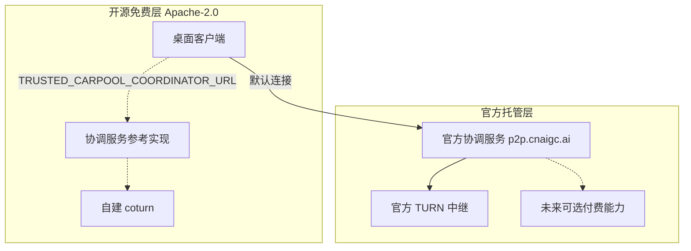

# 商业模式说明（Open Core）

本文档向用户和贡献者透明地说明「可信拼车」如何在保持免费开源的同时可持续运营，避免未来任何"先开源后收费"的误解。

## 一句话承诺

**客户端、协调服务参考实现与通信协议永久采用 Apache-2.0 免费开源；自建部署不受任何功能限制、不需要授权，也永远不会加入付费墙。**

## 分层结构

| 层 | 内容 | 许可证 / 费用 |
| --- | --- | --- |
| 开源免费层 | 桌面客户端（Tauri + Rust + React）、协调服务参考实现（`deploy/coordinator/`）、TURN 凭据协议、全部文档 | Apache-2.0，永久免费 |
| 官方托管层 | `p2p.cnaigc.ai` 协调服务与 TURN 中继（默认接入点，免注册、免配置） | 现阶段免费 |
| 未来可选付费层 | 只叠加在官方托管服务之上的增值能力（见下方路线图） | 未来按需推出 |

## 现在免费且承诺持续免费的部分

- 全部客户端功能：发车、上车、四座并发、用量统计、限额、额度展示、托盘常驻。
- 官方托管协调服务的基础能力：邀请注册与解析、信令信箱、TURN 时效凭据。
- 自建部署路径：参考实现 + [SELF-HOSTING.md](SELF-HOSTING.md)，与官方托管完全同协议。

## 未来可能的付费方向（路线图，非承诺）

以下方向只会以"官方托管服务的可选增值"形式出现，不会写进开源代码的付费判断，也不会削减现有免费能力：

- 团队 / 组织管理：多车队集中管理、成员目录、管理员视图。
- 更大规模：超过 4 座位的托管协调与并发支持。
- 用量报表：跨车队汇总、导出、账期报告。
- 网络质量：TURN 优先带宽、区域节点、SLA。
- 优先支持：工单响应、部署协助。

若上述任何方向落地，会先在 GitHub Discussions/issue 公示方案并更新本文档。

## 资金渠道

- 官方托管服务未来的可选付费能力（如上）。
- 赞助渠道（GitHub Sponsors 等）开通后会在 README 与本文档注明。

## 明确不做的事

- 不出售、不出租座位，不引入押金、积分、结算、扣罚（详见 [LEGAL.md](../LEGAL.md) 与 [PRODUCT-BRIEF.md](PRODUCT-BRIEF.md)）。
- 不收集、不出售用户数据；托管服务只保存签名邀请元数据与短期信令。
- 不对开源代码追加商业限制条款（不转 BSL/Elastic 类许可证）。
- 不在客户端里加遥测换取收入。

## 对贡献者的意义

贡献按 Apache-2.0 + DCO 接收（见 [CONTRIBUTING.md](../CONTRIBUTING.md)），项目不要求签署版权转让型 CLA，维护者与任何公司都无法单方面把已有开源代码改为闭源或限制性许可证。
